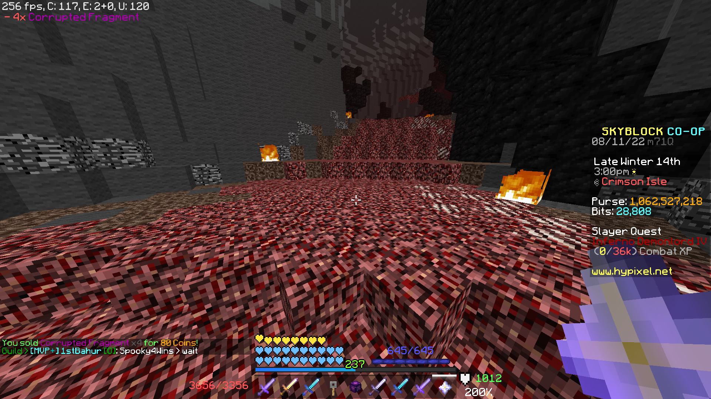
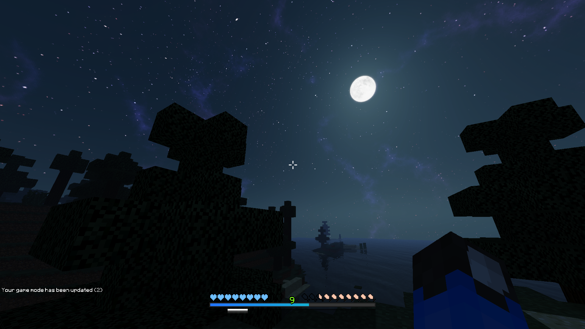

# tandypack

## a minecraft 1.8.9 texture pack

This texturepack was a photoshop of other texturepacks that I've liked. I added a few things here and there, but most of the credit goes to the original creators of the texturepacks that I used.

Since I made this several years ago, a lot of the creators might've gone uncredited, but I added the ones that I could remember.

- [GUI/HUD](https://www.minecraftforum.net/forums/mapping-and-modding-java-edition/resource-packs/2091418-patrixs-minimal-gui-animated-menu-colors-updated)
- [Technoblade's pack?](https://www.youtube.com/watch?v=5Z3XkzXZ4Yg)
- [1.14 Items (Swords, Bows, Fishing Rod, etc.):](https://www.youtube.com/watch?v=mVCachZ8u5E)
- [1.8.9 GUI fix](https://www.youtube.com/watch?v=09OXfmsUGUg)
- [Soartex Fanver 1.14 (1.8.9 Download link is broken)](
https://soartex.net/downloads/)
- [Invictus 1.8.9](https://www.curseforge.com/minecraft/texture-packs/invictus-vanilla)

